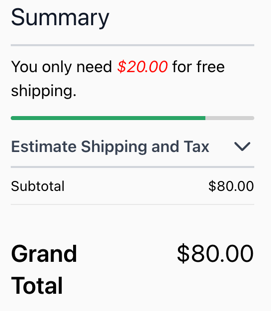

# Scandiweb UI - freeshipping-bar.A

This component adds free shipping bar to the checkout cart summary section.

## Usage - Template

1. Copy or merge the `Magento_Checkout` folder into your theme.
2. Copy the CSS styles below into your theme.
3. Add `@import url(components/scandiweb_ui/freeshipping-bar.css);` in web::tailwind/tailwind-source.css
4. Create your development or production bundle by running `npm run watch` or `npm run build-prod` in your
   theme's tailwind directory.

## Dependencies

This component requires `bsscommerce/free-shipping-bar` 1.1.3 package. 

## Compatibility

This component works with Tailwind version 3, and Alpine version 3.

## Screenshots

### Summary Section

